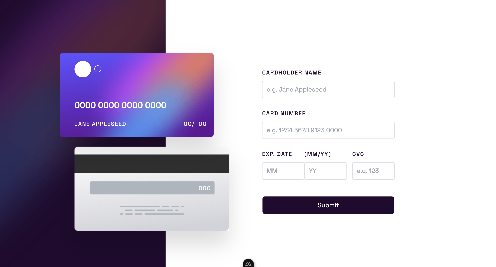

# Frontend Mentor - Interactive card details form solution

This is a solution to
the [Interactive card details form challenge on Frontend Mentor](https://www.frontendmentor.io/challenges/interactive-card-details-form-XpS8cKZDWw).
Frontend Mentor challenges help you improve your coding skills by building realistic projects.

### The challenge

Users should be able to:

- Fill in the form and see the card details update in real-time
- Receive error messages when the form is submitted if:
    - Any input field is empty
    - The card number, expiry date, or CVC fields are in the wrong format
- View the optimal layout depending on their device's screen size
- See hover, active, and focus states for interactive elements on the page

### Screenshot

### Links

- Live Site URL: [https://frontend-mentor-interactive-card-form.netlify.app
  ](https://frontend-mentor-interactive-card-form.netlify.app
  )
- Solution
  URL: [https://www.frontendmentor.io/solutions/interactive-card-form-with-nuxt-and-formkit-Y5uIZ-L2ph](https://www.frontendmentor.io/solutions/interactive-card-form-with-nuxt-and-formkit-Y5uIZ-L2ph)

## My process

### Built with

- Semantic HTML5 markup
- CSS custom properties
- Flexbox
- Nuxt
- Tailwind CSS
- Typescript
- Formkit

